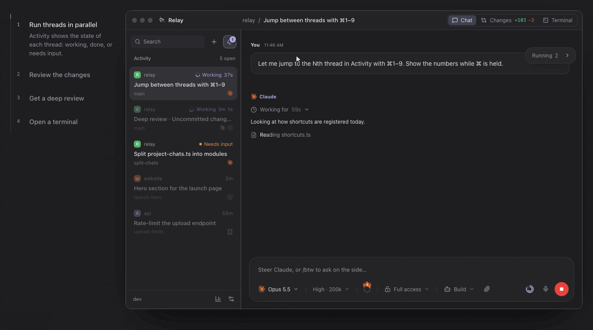

<h1 align="center">Relay</h1>

<p align="center">
  <strong>One workspace for your coding agents.</strong><br>
  Claude, Codex, OpenCode, Cursor, Amp, Antigravity and any ACP agent, on the subscriptions you already pay for.<br>
  Open source (MIT) for macOS, Windows and Linux, with an Android app and a headless mode for servers.
</p>

<p align="center">
  <a href="https://relaycode.io/download/"><strong>Download</strong></a>
  ·
  <a href="https://relaycode.io">Website</a>
  ·
  <a href="#how-relay-compares">How it compares</a>
  ·
  <a href="#for-contributors">Build it yourself</a>
</p>



## Get started

Relay is an **early preview**. Grab your build from the [latest release](https://github.com/relaycodehq/relay/releases/latest):

| System | Download | Status |
| --- | --- | --- |
| macOS (Apple Silicon) | `Relay-<version>-mac-arm64.dmg` | Used daily. Ad-hoc signed, not notarized. |
| Windows 10/11 (x64) | `Relay-<version>-win-x64.exe` | Built every release, less daily use. |
| Linux (x86-64) | `Relay-<version>-linux-x86_64.AppImage` | Cross-built, thinly tested on real distributions. |
| Omarchy | `Relay-<version>-omarchy-x86_64.tar.gz`, then `python3 install.py` inside it (no sudo) | As Linux. |

1. Sign in to at least one agent CLI: [Claude Code](https://docs.anthropic.com/en/docs/claude-code), [Codex](https://github.com/openai/codex), [OpenCode](https://opencode.ai) or [Amp](https://ampcode.com). Relay installs a missing one. Cursor, Antigravity and agents from the ACP registry are set up under **Settings → AI models**.
2. Open Relay and add a project folder, or run `relay .` in it (choose **Relay → Install "relay" Command…** once on macOS or Linux).
3. Type what you want done, pick the agent and model, and press **Send**.

No Relay account, no API keys, and it updates itself.

For a server or a spare computer, like a Mac mini in a cupboard, the [headless Relay](docs/headless.md) installs with one command, starts with the computer and pairs with your phone:

```console
curl -fsSL https://relaycode.io/install.sh | sh
```

> [!NOTE]
> Builds aren't code-signed yet, so the first launch takes one extra click:
>
> - **macOS:** close the "can't verify" dialog, then **System Settings → Privacy & Security → Open Anyway** (or run `xattr -cr /Applications/Relay.app`). Move Relay to **Applications** first, or it can't update itself.
> - **Windows:** SmartScreen's "Windows protected your PC" → **More info → Run anyway**.
> - **Linux:** `chmod +x` the AppImage. Some distributions need their FUSE compatibility package.

## How Relay compares

People choosing between these apps tend to ask three things: can I use the subscription I already pay for, can the agents run on another machine, and can I follow and answer them from my phone. Relay does all three, for free, with no account and no server of ours in between:

- **Your subscriptions.** Each agent runs through its own CLI and sign-in, so your Claude or ChatGPT plan does the work. Several agents side by side, and switch agent mid-thread.
- **Remote.** Run the headless Relay on a box you own. Hand it a thread from your laptop mid-conversation and take it back later.
- **Mobile.** A native Android app connects straight to your computer over your own Tailscale, end-to-end encrypted, with no hosted server in between. Start threads, answer approvals, dictate, review and commit.

| | Your subscriptions | Agents on another machine | Phone | Source |
| --- | --- | --- | --- | --- |
| **Relay** | Claude, Codex, OpenCode, Cursor, Amp, Antigravity, ACP. Free | Headless Relay on your box; hand threads over mid-conversation | Native Android, direct over your Tailscale | MIT |
| [T3 Code](https://github.com/pingdotgg/t3code) | Many vendors, ACP. Free | SSH, Tailscale or pairing; optional hosted tunnel | Native iOS and Android, direct or via their tunnel | MIT |
| [Jean](https://jean.build) | Many vendors. Free | Headless Linux server | Web UI served by your server | Apache-2.0 |
| [Conductor](https://conductor.build) | Claude Code, Codex, OpenCode, Cursor. Free tier, Pro $50/mo | Their managed cloud (Pro) | iOS, cloud workspaces only (Pro) | Proprietary |
| [Superset](https://superset.sh) | 20+ CLI agents. Free tier, Pro $20/user/mo | Your host through their hosted relay (Pro) | iPhone and iPad, via their relay (Pro) | ELv2, source-available |
| Claude Code desktop | Claude plans only | SSH or Anthropic's cloud | Claude app, via Anthropic | Proprietary |
| Codex app | ChatGPT plans only | SSH or Codex Cloud | ChatGPT app, via OpenAI | CLI only (Apache-2.0) |

Where Relay stands out: a thread moves to another of your computers mid-conversation, uncommitted changes and all, and comes back; and in deep review a lead agent checks every finding from several reviewing models before fixing what holds up. Where it's behind: no iOS app yet, and no managed cloud sandboxes.

<sub>Checked October 2026 against each product's own docs and pricing. Something out of date? [Open an issue](https://github.com/relaycodehq/relay/issues/new/choose).</sub>

## What it does

| | |
| --- | --- |
| **Run many threads at once** | Activity shows which thread is working, which is done and which needs you. Jump between them with ⌘1–9. |
| **Watch every step** | Commands, reads, edits and subagents appear live, then fold away when the answer lands. |
| **Review every edit** | The working tree side by side with the conversation. Stage, commit and push from the thread; browse history in a commit graph. |
| **Deep review** | Several models read your changes, then a lead checks every finding and fixes what holds up. |
| **Work in isolation** | Give a thread its own Git worktree, even mid-conversation, and land it through a normal branch merge. |
| **Use a terminal** | Every thread has its own shell under the conversation. |
| **Review pull requests** | GitHub through your `gh` login, or Gitea, with CI status in the title bar. |
| **Keep an eye on limits** | Usage meters for Claude and Codex, the weekly limit paced on the hours you actually work. |
| **Make it yours** | Built-in themes or any VS Code theme from Open VSX, plus fonts and interface scale. |

## Good to know

- Relay embeds no agent and no API key. Each agent sends only what it would send from its own CLI.
- Threads, drafts and settings stay on your computer, in `~/Library/Application Support/Relay Experimental` (macOS), `%APPDATA%\Relay Experimental` (Windows) or `~/.config/Relay Experimental` (Linux). Saved tokens go to the OS credential store; chat history isn't encrypted.
- Relay never checks out, resets, pulls, force-pushes or stages on its own. Git actions that change your checkout or remote happen only when you click them.
- Relay is independent and not affiliated with OpenAI, Anthropic, Google, OpenCode, Cursor (Anysphere), Amp or the makers of other agents it runs. Cursor's SDK isn't part of Relay: it is downloaded from npm when you ask, under Cursor's Terms of Service.

## Documentation

- [Project workspace](docs/project-workspace.md): threads, panes, agents, permissions, queues and composer commands.
- [Phone app](docs/phone.md): pairing, what the phone can do, and how the connection is secured.
- [Headless Relay](docs/headless.md): Relay without its window on a server or a spare computer.
- [Pull request review](docs/pr-review.md): the review workflow, grouping and live checks.
- [Development and releases](docs/development.md): tests, packaging, updates and release status.

## For contributors

Adding an agent? Start with the [agent adapter architecture](docs/agent-adapters.md): integration routes, runtime and session contracts, and examples from previous additions.

```console
npm ci
npm run dev
```

You need Node.js 22+ (and Python 3 only for the Omarchy bundle). `npm test` runs the unit suite, `npm run test:e2e` drives the real Electron app with hidden windows, and `npm run package:mac` (or `win`, `linux`, `omarchy`) builds installers into `release/`. A `v*` tag on `main` builds and publishes every installer; pushing to `main` alone ships nothing.

<details>
<summary><strong>Refresh the README demo and the teaser</strong></summary>

Both are recorded from preview pages that render the app's own components on sample data. With the dev server on port 5177, `ffmpeg` and `gifsicle` installed:

```console
node scripts/record-readme-demo.mjs   # docs/media/relay-demo.gif, one loop of the website's tour
node scripts/record-teaser.mjs        # test-results/teaser/, 1080p60 (--scale 2 for 4K)
```

Copy the teaser to `docs/media/relay-teaser.mp4` when the UI changes.

</details>

## Troubleshooting

- **An agent isn't found:** Relay reads your login shell's `PATH`, so a CLI that works in a new terminal works in Relay. Restart Relay after installing one.
- **An agent says it's signed out:** sign in again in the thread's terminal, or with the CLI's login command in your own.
- **macOS keeps asking for Keychain access:** ad-hoc signed builds can ask again after an update. Denying only keeps you signed out of Gitea.
- **The update doesn't install on macOS:** move `Relay.app` into **Applications** (or any writable folder) and try again.
- **Linux won't start:** check that user namespaces are enabled for Chromium's sandbox. Don't disable the sandbox instead.
- **Corrupt state:** Relay keeps the unreadable file and reports an error rather than overwriting it. Back up the data folder before repairing it.

## Contact

Questions, ideas or anything else: [hello@relaycode.io](mailto:hello@relaycode.io). For a bug, please [open an issue](https://github.com/relaycodehq/relay/issues) with the steps, your platform and your Relay version. Pull requests are welcome; small, focused ones are easiest to review.

## License

Relay is released under the [MIT License](LICENSE). You can use, modify and redistribute it, including commercially, as long as the copyright and license notice stay with it.

Copyright (c) 2026 Relay contributors

Third-party components keep their own licenses; they are listed in [THIRD_PARTY_NOTICES.md](THIRD_PARTY_NOTICES.md).
