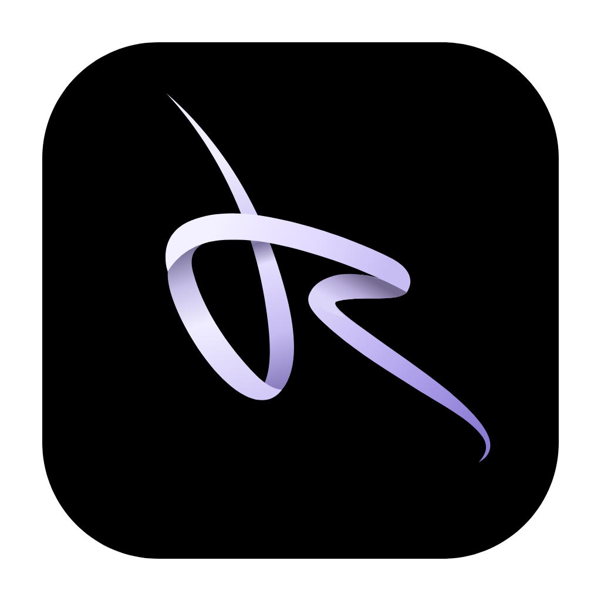
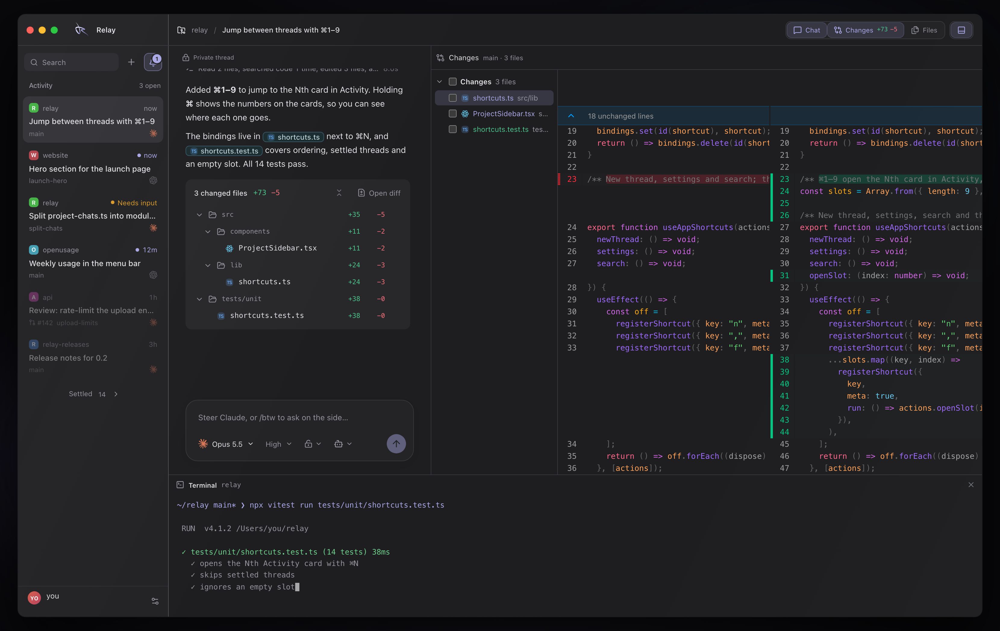
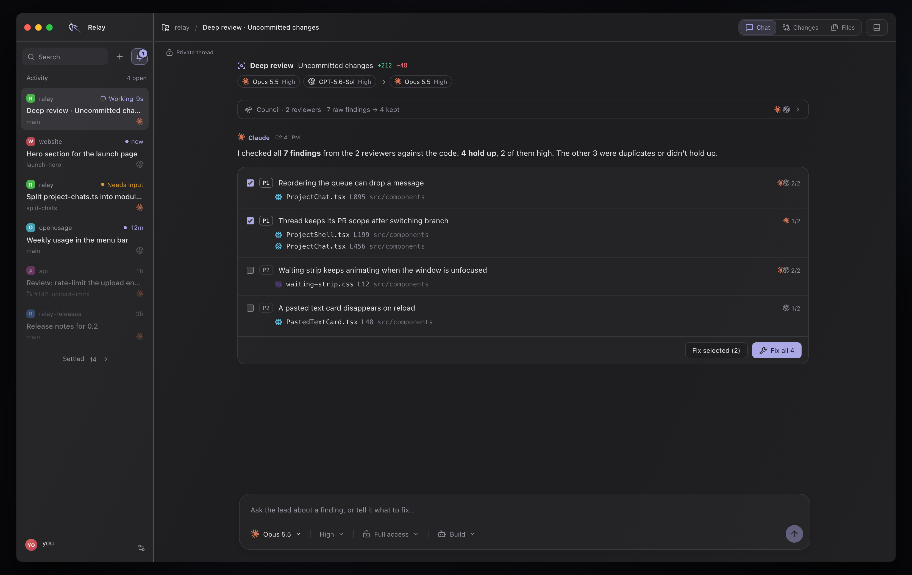

<p align="center">
  
</p>

<h1 align="center">Relay</h1>

<p align="center">
  Your agents, your code and your reviews. One workspace.
</p>

<p align="center">
  <a href="https://github.com/lubomirmolin/relay-releases/releases/latest"><strong>Download Relay</strong></a>
  ·
  <a href="#what-can-it-do">See what it can do</a>
  ·
  <a href="#for-contributors">Build it yourself</a>
</p>



<p align="center"><sub>A thread, its changes and its terminal, on sample data from the teaser.</sub></p>

[Watch the 58-second teaser](docs/media/relay-teaser.mp4)

## Download, sign in, and go

Relay is an **early preview**, built and used daily on macOS. Windows and Linux builds ship from the same release, with less mileage.

Grab the file for your system from the [latest release](https://github.com/lubomirmolin/relay-releases/releases/latest):

| System | Download |
| --- | --- |
| macOS (Apple Silicon) | `Relay-<version>-mac-arm64.dmg` |
| Windows 10/11 (x64) | `Relay-<version>-win-x64.exe` installer |
| Linux (x86-64) | `Relay-<version>-linux-x86_64.AppImage` |
| Omarchy | `Relay-<version>-omarchy-x86_64.tar.gz`, then run `python3 install.py` inside it (no sudo) |
| Intel Mac | No package yet, so [build from source](#for-contributors) |

Then:

1. Install and sign in to at least one agent CLI: [Codex](https://github.com/openai/codex), [Claude Code](https://docs.anthropic.com/en/docs/claude-code), or [OpenCode](https://opencode.ai).
2. Open Relay and add a project folder.
3. Type what you want done, pick the agent and model, and press **Send**.

Relay runs the agents on your computer with your own subscriptions. No Relay account is required, and it updates itself when a new release is out.

> [!NOTE]
> Builds are not code-signed yet, so the first launch needs one extra click:
>
> - **macOS:** macOS says it can't verify the app. Close the dialog, open **System Settings → Privacy & Security**, scroll down, and click **Open Anyway**. Alternatively, run `xattr -cr /Applications/Relay.app` once in Terminal.
> - **Windows:** SmartScreen says “Windows protected your PC”. Choose **More info → Run anyway**.
> - **Linux:** make the AppImage executable (`chmod +x`). Some distributions need their FUSE compatibility package.
>
> Move Relay to **Applications** on macOS before the first update; it can't replace itself while it runs from the Downloads quarantine.

## What can it do?

| | |
|---|---|
| **Talk to your agents** | Claude, Codex and OpenCode in one place. Pick the model and effort per thread, and switch agents mid-thread with a handoff note. |
| **Run many threads at once** | The Activity list shows which thread is working, which is done and which needs you. Jump between them with ⌘1–9. |
| **Watch every step** | Commands, file reads, edits and subagents appear live, then fold away behind **Worked for…** when the answer lands. |
| **Review every edit** | See the working tree side by side next to the conversation. Stage, commit and push without leaving the thread, and browse history in a commit graph. |
| **Work in isolation** | Give a thread its own Git worktree, then land it through a regular branch merge. |
| **Use a terminal** | Every thread has its own shell, right under the conversation. |
| **Deep review** | Several models read your changes, then a lead checks every finding and fixes what holds up. |
| **Plan with a council** | In Ultraplan mode, thinkers on different models study the problem, then a lead checks their notes against the code and writes the plan. |
| **Ask on the side** | `/btw` for a quick side question, Scratchpad (⌘⇧N) for chats that don't belong to a project. |
| **Review pull requests** | A Gitea inbox with comments, viewed progress, Codex-grouped repeated changes and live TypeScript/Angular checks. CI status for GitHub and Gitea sits in the title bar. |
| **Keep an eye on limits** | Usage meters for Claude and Codex, with the weekly limit paced on the hours you actually work. |
| **Make it yours** | Built-in themes or any VS Code theme from Open VSX, plus fonts, sizes and interface scale. |



## Platform status

| Platform | Status |
| --- | --- |
| macOS (Apple Silicon) | Primary development target. Ad-hoc signed, not notarized. |
| Windows x64 | Built and released from CI on every push, with Windows-specific fixes landing regularly. Less daily use than macOS. |
| Linux x86-64 | AppImage and Omarchy bundle are cross-built. Runtime testing on real distributions is still thin. |

Automated tests do not cover real agent accounts, OS credential prompts, signing or every Linux desktop. What was actually verified is in [VERIFICATION.md](VERIFICATION.md).

## Good to know

- Relay doesn't embed any agent or API key. Each agent runs through its own CLI and account, and only sends what that agent would send anyway.
- Threads, drafts and settings stay local. Data lives in `~/Library/Application Support/Relay Experimental` on macOS, `%APPDATA%\Relay Experimental` on Windows and `~/.config/Relay Experimental` on Linux.
- Saved tokens are encrypted with the OS credential store (Keychain on macOS). Chat history and folder paths are not encrypted.
- Relay never checks out, resets, pulls, force-pushes or stages files on its own. Git actions that change your checkout or remote happen only when you click them.
- Pull request review and shared conversations currently need a Gitea server. Everything else works with any local folder, Git or not.
- Relay is an independent project and is not affiliated with OpenAI, Anthropic or OpenCode.

## Share a conversation

**Share conversation** uploads a thread's saved history to a room server and creates a one-time invitation. Coworkers see completed answers, not your live output, and everyone runs their own agent in their own clone. Secrets are redacted from the outgoing copy.

Rooms need a Gitea server and a room server you trust. Setup is in the [room server guide](server/README.md).

## More documentation

- [Project workspace](docs/project-workspace.md): threads, panes, agents, permissions, queues and composer commands.
- [Pull request review](docs/pr-review.md): Gitea sign-in, the review workflow, grouping, live checks and local data.
- [Phone app](docs/phone.md): pairing a phone to follow and answer threads, and how the connection is secured.
- [Development and releases](docs/development.md): tests, packaging, automatic updates and release status.
- [Updating T3 streaming](docs/t3-streaming.md): how the vendored T3 Code modules are kept in sync.

## For contributors

<details>
<summary><strong>Build and run from source</strong></summary>

You need Node.js 22+ and npm. Python 3 is only needed for the Omarchy bundle and its tests.

```console
npm ci
npm run dev
```

Useful checks:

```console
npm run build
npm run format:check
npm test
npm run test:e2e
```

`npm test` runs the whole unit suite; pass a file path to run just one. `npm run test:e2e` drives the real Electron app against an isolated local Gitea fixture, with windows hidden and synthetic credential storage.

`npm run package:mac`, `package:win`, `package:linux` and `package:omarchy` build installers into `release/`. Every push to `main` builds and publishes all of them to [relay-releases](https://github.com/lubomirmolin/relay-releases).

</details>

<details>
<summary><strong>Update the teaser</strong></summary>

The teaser is a regular preview page, rendered frame by frame from the app's own components on sample data. With the dev server running on port 5177 and `ffmpeg` installed:

```console
node scripts/record-teaser.mjs              # 1080p60
node scripts/record-teaser.mjs --scale 2    # 4K
node scripts/record-teaser.mjs --stills 28  # a PNG of one moment
```

Output goes to `test-results/teaser/`. Copy the result to `docs/media/relay-teaser.mp4` when the UI changes, and refresh the screenshots in `docs/media/` with it.

</details>

## Troubleshooting

- **An agent isn't found:** Relay reads your login shell's `PATH`, so a CLI that works in a new terminal should work in Relay too. Restart Relay after installing one.
- **An agent says it's signed out:** sign in again in the thread's terminal, or run the CLI's login command in your own terminal.
- **macOS keeps asking for Keychain access:** local builds are ad-hoc signed, so macOS may ask again after an update. Denying it only keeps you signed out of Gitea; threads keep working.
- **The update doesn't install on macOS:** move `Relay.app` into **Applications** (or any writable folder) and try again.
- **Linux won't start:** check that user namespaces are enabled for Chromium's sandbox. Don't disable the sandbox to work around it.
- **Corrupt state:** Relay preserves the unreadable file and reports an error instead of overwriting it. Back up the data folder above before repairing it.

## License

Relay is released under the [MIT License](LICENSE). You can use, modify and redistribute it, including commercially, as long as the copyright and license notice stay with it.

Copyright (c) 2026 Relay contributors

Third-party components keep their own licenses. Relay includes MIT-licensed components adapted from [T3 Code](https://github.com/pingdotgg/t3code); their provenance and license are in [THIRD_PARTY_NOTICES.md](THIRD_PARTY_NOTICES.md).
